# Kurikulum Self-Study: Transisi Karir QA Lead → QA Manager

## Tentang Kurikulum Ini

Kurikulum ini dirancang untuk **Fachrulch**, QA Lead/Senior QA di industri Fintech Trading (domain US Stock & UAE Stock Market), yang ingin bertransisi ke posisi **QA Manager**. Berdasarkan riset pasar komprehensif, kurikulum ini mencakup semua skill gap yang perlu ditutup, lengkap dengan sumber belajar dan aktivitas praktek.

**Pergeseran Mindset yang Harus Dilakukan:**

> Dari "Bagaimana cara saya testing ini?" → Menjadi "Mengapa kita testing ini, dan ke mana arah kualitas organisasi kita?"

---

## Peta Pembelajaran


---

## Cara Menggunakan Kurikulum Ini

- Ikuti **Fase 1 → 2 → 3** secara berurutan
- Jalankan **Domain Fintech** secara paralel di semua fase
- Tandai setiap item dengan `[x]` ketika selesai
- Gunakan **Checkpoint Evaluasi** di akhir setiap fase untuk mengukur kesiapan

---

## Fase 1: Fondasi Leadership

**Fokus:** Membangun pemahaman dasar skill manajerial yang belum dimiliki sebagai QA Lead.

---

### Modul 1.1: People Management Dasar

**Mengapa penting:** QA Manager menghabiskan 70% waktunya untuk mengelola manusia, bukan testing. Ini adalah pergeseran terbesar dari QA Lead.

#### Topik yang Harus Dikuasai

- [ ] Perbedaan antara *managing tasks* dan *managing people*
- [ ] Situational Leadership Model (Hersey & Blanchard)
- [ ] Teknik pemberian feedback yang efektif (model SBI: Situation-Behavior-Impact)
- [ ] Cara melakukan 1:1 meeting yang produktif
- [ ] Dasar-dasar conflict resolution dalam tim
- [ ] Teknik motivasi (teori Maslow, Herzberg's Two-Factor Theory)

#### Sumber Belajar

- **Buku:** *The Manager's Path* -- Camille Fournier (wajib baca untuk transisi ke manajemen di tech)
- **Buku:** *Radical Candor* -- Kim Scott (feedback yang jujur tanpa menyakiti)
- **Kursus:** [LinkedIn Learning - Transitioning from Individual Contributor to Manager](https://www.linkedin.com/learning/)
- **Kursus:** [Coursera - Leading Teams (University of Michigan)](https://www.coursera.org/)
- **Artikel:** [First Round Review - Manager Guides](https://review.firstround.com/managers/)

#### Aktivitas Praktek

- **Latihan 1.1.1 -- Jadwalkan 1:1 Mingguan**
  Mulai lakukan 1:1 meeting mingguan dengan setiap anggota tim QA. Gunakan template:
  ```
  1. Apa yang sedang kamu kerjakan minggu ini?
  2. Adakah hambatan yang bisa saya bantu?
  3. Bagaimana progressmu terhadap tujuan jangka panjangmu?
  4. Feedback untukku sebagai lead?
  ```

- **Latihan 1.1.2 -- Feedback Journal**
  Catat 1 feedback yang kamu berikan ke anggota tim setiap minggu. Gunakan format SBI:
  - **Situation:** Konteks spesifik kapan/di mana kejadian terjadi
  - **Behavior:** Perilaku yang kamu observasi (bukan asumsi)
  - **Impact:** Dampak konkret dari perilaku tersebut

- **Latihan 1.1.3 -- Buat Individual Development Plan (IDP)**
  Buat IDP untuk minimal 1 anggota tim. Identifikasi: kekuatan, area pengembangan, tujuan karir, dan langkah konkret.

---

### Modul 1.2: Strategic Thinking

**Mengapa penting:** QA Manager harus bisa menjawab "mengapa" dan "ke mana", bukan hanya "bagaimana".

#### Topik yang Harus Dikuasai

- [ ] Perbedaan tactical vs strategic thinking
- [ ] Framework OKR (Objectives & Key Results) untuk QA
- [ ] Cara menyelaraskan quality goals dengan business goals
- [ ] Dasar-dasar risk management (identify, assess, mitigate, monitor)
- [ ] Cara membuat Quality Strategy Document
- [ ] Prioritization frameworks (MoSCoW, RICE, risk-based)

#### Sumber Belajar

- **Buku:** *Measure What Matters* -- John Doerr (OKR framework)
- **Buku:** *The Art of Strategic Thinking* -- Michael Robert
- **Artikel:** [Google re:Work - OKR Guide](https://rework.withgoogle.com/guides/set-goals-with-okrs/)
- **Kursus:** [Coursera - Strategic Leadership and Management (UIUC)](https://www.coursera.org/)

#### Aktivitas Praktek

- **Latihan 1.2.1 -- Tulis Quality Strategy Document (Draft Pertama)**
  Buat dokumen 1-2 halaman yang menjawab:
  - Apa visi kualitas tim kita?
  - Apa 3 tujuan utama QA untuk kuartal ini?
  - Bagaimana tujuan ini mendukung tujuan bisnis/produk?
  - Apa metrik keberhasilan yang kita gunakan?

- **Latihan 1.2.2 -- Risk Register Triwulanan**
  Buat risk register untuk proyek yang sedang kamu tangani:
  - Identifikasi 5-10 risiko teknis/proses
  - Nilai setiap risiko: Probabilitas × Impact (P0-P3)
  - Tentukan strategi mitigasi: avoidance, reduction, sharing, atau acceptance

- **Latihan 1.2.3 -- Presentasi Strategi ke Atasan**
  Presentasikan Quality Strategy Document ke manager atau atasan kamu. Minta feedback: apakah sudah selaras dengan tujuan bisnis?

---

### Modul 1.3: Budget & Resource Awareness

**Mengapa penting:** QA Manager bertanggung jawab atas anggaran departemen dan alokasi sumber daya.

#### Topik yang Harus Dikuasai

- [ ] Cara membaca dan memahami budget laporan (P&L basics)
- [ ] Cara mengestimasi biaya testing: tools, lisensi, training, SDM
- [ ] Evaluasi tools: commercial vs open-source (cost-benefit analysis)
- [ ] Konsep ROI dari investasi QA
- [ ] Dasar-dasar resource planning dan capacity planning
- [ ] Work Breakdown Structure (WBS) untuk estimasi proyek

#### Sumber Belajar

- **Buku:** *Financial Intelligence for IT Professionals* -- Karen Berman
- **Kursus:** [Coursera - Finance for Non-Finance Managers](https://www.coursera.org/)
- **Kursus:** [LinkedIn Learning - Budget Management for Managers](https://www.linkedin.com/learning/)

#### Aktivitas Praktek

- **Latihan 1.3.1 -- Hitung Total Cost of Ownership (TCO) Tim QA**
  Estimasikan biaya tim QA kamu per bulan/kuartal:
  - Biaya tools (license Jira, TestRail, automation tools, dll.)
  - Estimasi biaya SDM (berdasarkan market rate, bukan gaji aktual)
  - Biaya training/sertifikasi
  - Presentasikan ke manager dan minta feedback

- **Latihan 1.3.2 -- ROI Calculator untuk Automation**
  Hitung ROI dari test automation yang sudah ada di tim:
  - Berapa banyak test cases yang ter-otomasi?
  - Berapa jam testing manual yang tersimpan per sprint?
  - Berapa biaya maintenance automation?
  - Apakah ROI-nya positif?

- **Latihan 1.3.3 -- Proposal Tool Baru**
  Identifikasi 1 tool/investasi yang bisa meningkatkan produktivitas tim. Buat proposal singkat (1 halaman) yang mencakup: masalah yang dipecahkan, solusi yang diusulkan, biaya, dan expected ROI. Presentasikan ke atasan.

---

### Modul 1.4: Executive Communication

**Mengapa penting:** Kemampuan komunikasi adalah skill #1 yang disebut oleh hampir semua sumber untuk QA Manager.

#### Topik yang Harus Dikuasai

- [ ] Cara menyampaikan informasi teknis kepada audiens non-teknis
- [ ] Struktur executive summary yang efektif (BLUF: Bottom Line Up Front)
- [ ] Cara membuat status report yang bermakna bagi manajemen
- [ ] Teknik storytelling dengan data (dari metrik ke narasi)
- [ ] Cara mengadvokasi concern kualitas kepada senior leadership
- [ ] Dasar-dasar negosiasi dan influence without authority

#### Sumber Belajar

- **Buku:** *The Pyramid Principle* -- Barbara Minto (komunikasi terstruktur)
- **Buku:** *Influence: The Psychology of Persuasion* -- Robert Cialdini
- **Kursus:** [Coursera - Communication for Engineers (Duke)](https://www.coursera.org/)
- **Kursus:** [LinkedIn Learning - Executive Presence](https://www.linkedin.com/learning/)

#### Aktivitas Praktek

- **Latihan 1.4.1 -- Tulis Executive Summary Mingguan**
  Setiap akhir sprint, tulis executive summary status QA (maks. 5 baris) yang menjawab:
  - Apa kondisi kualitas saat ini? (GREEN/YELLOW/RED)
  - Apa risiko terbesar minggu ini?
  - Apa action item yang dibutuhkan dari manajemen?

- **Latihan 1.4.2 -- Presentasi Metrik ke Stakeholder**
  Siapkan dan presentasikan dashboard QA sederhana (bisa di Google Slides) kepada product manager atau engineering manager. Fokus pada: apa artinya data ini bagi bisnis, bukan hanya angkanya.

- **Latihan 1.4.3 -- Latihan Advocacy**
  Simulasikan skenario: product manager ingin merilis fitur padahal ada 2 bug P1 yang belum teratasi. Tulis argumen (1 paragraf) yang akan kamu sampaikan untuk menunda release. Gunakan data dan framing risiko bisnis, bukan opini teknis.

---

### Checkpoint Evaluasi Fase 1

Tandai item berikut sebelum lanjut ke Fase 2:

- [ ] Sudah melakukan 1:1 meeting rutin dengan semua anggota tim selama minimal 1 bulan
- [ ] Sudah menulis dan mempresentasikan Quality Strategy Document
- [ ] Sudah menghitung TCO tim QA dan mempresentasikan ke atasan
- [ ] Sudah menulis minimal 4 executive summary mingguan
- [ ] Sudah mendapatkan feedback dari atasan/peer tentang kemajuan leadership

---

## Fase 2: Bangun Pengalaman Leadership

**Fokus:** Mengambil tanggung jawab yang lebih luas melampaui scope QA Lead biasa.

---

### Modul 2.1: Cross-Team Coordination

**Mengapa penting:** QA Manager mengelola hubungan dengan multiple stakeholder -- Engineering, Product, DevOps, Security, Compliance.

#### Topik yang Harus Dikuasai

- [ ] Teknik fasilitasi meeting lintas tim
- [ ] Cara mengelola dependency antar tim
- [ ] Stakeholder mapping dan engagement strategy
- [ ] RACI matrix untuk clarifikasi tanggung jawab
- [ ] Cara menangani perbedaan prioritas antar tim

#### Sumber Belajar

- **Buku:** *Getting Things Done* -- David Allen (manajemen produktivitas dan koordinasi)
- **Buku:** *Crucial Conversations* -- Patterson et al. (komunikasi sulit lintas tim)
- **Kursus:** [Coursera - Project Management Principles (Google)](https://www.coursera.org/professional-certificates/google-project-management)

#### Aktivitas Praktek

- **Latihan 2.1.1 -- Pimpin Kick-off Meeting Lintas Tim**
  Volunteer untuk memimpin kick-off meeting untuk fitur atau proyek baru yang melibatkan tim QA + Development + Product. Buat agenda, pimpin diskusi, dan dokumentasikan action items.

- **Latihan 2.1.2 -- Buat Stakeholder Map**
  Petakan semua stakeholder yang berinteraksi dengan tim QA:
  - Siapa mereka?
  - Apa kepentingan mereka terhadap QA?
  - Seberapa sering kamu perlu berkomunikasi dengan mereka?
  - Apa channel komunikasi yang paling efektif?

- **Latihan 2.1.3 -- Pimpin Quality Review Bulanan**
  Inisiasi dan pimpin quality review meeting bulanan yang melibatkan Engineering Manager dan Product Manager. Presentasikan metrik, tren, dan rekomendasi tindakan.

---

### Modul 2.2: Quality Metrics & Reporting

**Mengapa penting:** QA Manager harus bisa menunjukkan dampak bisnis dari aktivitas QA melalui data.

#### Topik yang Harus Dikuasai

- [ ] KPI QA yang bermakna vs vanity metrics
- [ ] Cara mendesain quality dashboard
- [ ] Analisis tren defect (defect aging, defect leakage rate)
- [ ] Automation coverage tracking yang efektif
- [ ] Cara mempresentasikan data QA kepada C-level
- [ ] DORA Metrics untuk tim engineering (Deployment Frequency, Lead Time, MTTR, Change Failure Rate)

#### KPI QA yang Benar-benar Penting

| Metrik | Apa yang Diukur | Target Ideal |
|--------|-----------------|--------------|
| **Defect Leakage Rate** | % bug yang lolos ke production | < 5% |
| **Defect Rejection Rate** | % bug yang ditolak developer (bukan valid) | < 10% |
| **P0/P1 Coverage %** | % fitur kritis yang tercover test | 100% P0, 80% P1 |
| **Automation Coverage** | % regression test yang ter-otomasi | > 70% |
| **Flakiness Rate** | % test yang flaky | < 2% |
| **Sprint Velocity Impact** | Apakah QA menjadi bottleneck? | Nol blocking |

#### Sumber Belajar

- **Artikel:** [Google DORA Metrics Guide](https://dora.dev/guides/dora-metrics-four-keys/)
- **Buku:** *Accelerate* -- Nicole Forsgren et al. (DORA metrics, engineering excellence)
- **Tool:** [Grafana / Kibana untuk dashboard](https://grafana.com/)

#### Aktivitas Praktek

- **Latihan 2.2.1 -- Bangun Quality Dashboard Sederhana**
  Buat dashboard QA menggunakan tool yang sudah ada di perusahaan (Jira, Confluence, Google Sheets, atau Grafana). Minimal tampilkan:
  - Defect leakage rate per sprint
  - P0/P1 test coverage
  - Automation coverage trend

- **Latihan 2.2.2 -- Quality Review Retrospective**
  Setelah setiap major release, lakukan quality retrospective (30 menit) dengan tim. Jawab: Apa yang berjalan baik? Apa yang perlu diperbaiki? Apa aksi konkret untuk release berikutnya?

- **Latihan 2.2.3 -- Laporan Kualitas Bulanan**
  Tulis laporan kualitas bulanan yang ditujukan kepada Engineering Manager/VP. Format: Executive Summary → Tren Utama → Risiko → Rekomendasi. Minta review dari atasan.

---

### Modul 2.3: Hiring & Onboarding

**Mengapa penting:** Salah satu tanggung jawab utama QA Manager adalah membangun dan mempertahankan tim yang kuat.

#### Topik yang Harus Dikuasai

- [ ] Cara menulis job description QA yang efektif
- [ ] Teknik structured interview untuk QA roles
- [ ] Cara mengevaluasi kandidat secara objektif (scorecard)
- [ ] Onboarding 30-60-90 hari yang efektif
- [ ] Cara mengidentifikasi A-players vs B-players
- [ ] Employer branding untuk menarik talenta QA terbaik

#### Sumber Belajar

- **Buku:** *Who: The A Method for Hiring* -- Geoff Smart & Randy Street
- **Buku:** *The First 90 Days* -- Michael Watkins (onboarding framework)
- **Kursus:** [LinkedIn Learning - Technical Recruiting](https://www.linkedin.com/learning/)

#### Aktivitas Praktek

- **Latihan 2.3.1 -- Tulis Job Description QA Engineer**
  Tulis job description untuk posisi QA Engineer di tim kamu. Sertakan: responsibilities, required skills, nice-to-have skills, dan apa yang membuat posisi ini menarik.

- **Latihan 2.3.2 -- Buat Interview Scorecard**
  Desain scorecard untuk mengevaluasi kandidat QA. Tentukan 5-7 kompetensi yang diukur dan skala penilaiannya (1-5). Gunakan ini dalam proses interview berikutnya.

- **Latihan 2.3.3 -- Buat Onboarding Plan 30-60-90 Hari**
  Buat onboarding plan untuk QA Engineer baru. Tentukan: apa yang harus mereka pelajari di 30 hari pertama, apa yang harus mereka capai di 60 hari, dan apa yang harus mereka deliver di 90 hari.

---

### Modul 2.4: Process Improvement

**Mengapa penting:** QA Manager bertanggung jawab merancang dan memperbaiki proses, bukan hanya mengikutinya.

#### Topik yang Harus Dikuasai

- [ ] Model PDCA (Plan-Do-Check-Act) untuk continuous improvement
- [ ] Root cause analysis (5 Whys, Fishbone Diagram)
- [ ] Process mapping dan Value Stream Mapping
- [ ] Cara mengidentifikasi bottleneck dalam QA pipeline
- [ ] Test process maturity models (TMMi)
- [ ] Cara memimpin process improvement initiative

#### Sumber Belajar

- **Buku:** *The Goal* -- Eliyahu Goldratt (theory of constraints)
- **Buku:** *Lean Software Development* -- Mary & Tom Poppendieck
- **Kursus:** [Coursera - Six Sigma Yellow Belt](https://www.coursera.org/)
- **Artikel:** [TMMi Foundation](https://www.tmmifoundation.org/)

#### Aktivitas Praktek

- **Latihan 2.4.1 -- Audit Proses QA Saat Ini**
  Lakukan audit menyeluruh proses QA tim kamu:
  - Petakan setiap langkah dari requirement masuk sampai release
  - Identifikasi bottleneck dan waste (rework, waiting, handoff berlebihan)
  - Dokumentasikan temuan dalam format sederhana

- **Latihan 2.4.2 -- Pimpin 1 Process Improvement Initiative**
  Pilih 1 bottleneck dari audit di atas. Gunakan PDCA untuk memperbaikinya. Dokumentasikan: Plan → Do → Check → Act. Bagikan hasil ke tim.

- **Latihan 2.4.3 -- Retrospective Triwulanan**
  Adakan retrospective triwulanan (bukan hanya per sprint) untuk melihat tren proses jangka panjang. Bandingkan metrik kualitas sekarang vs 3 bulan lalu.

---

### Checkpoint Evaluasi Fase 2

Tandai item berikut sebelum lanjut ke Fase 3:

- [ ] Sudah memimpin minimal 2 meeting lintas tim (cross-functional)
- [ ] Sudah membangun dan mempresentasikan quality dashboard kepada manajemen
- [ ] Sudah terlibat dalam minimal 1 proses hiring (interview kandidat)
- [ ] Sudah menyelesaikan minimal 1 process improvement initiative
- [ ] Sudah mendapat pengakuan dari atasan sebagai seseorang yang "sudah siap untuk tanggung jawab lebih"

---

## Fase 3: Transisi ke QA Manager

**Fokus:** Mengkonsolidasikan semua skill dan mempersiapkan diri secara konkret untuk posisi QA Manager.

---

### Modul 3.1: Full People Management

**Mengapa penting:** Di level ini, kamu harus mampu mengelola semua aspek SDM secara mandiri.

#### Topik yang Harus Dikuasai

- [ ] Performance review yang efektif dan fair
- [ ] Cara membuat Performance Improvement Plan (PIP)
- [ ] Career development planning untuk seluruh tim
- [ ] Menangani underperformer dengan empati tapi tegas
- [ ] Menangani konflik serius antar anggota tim
- [ ] Teknik delegation yang efektif (tanpa micromanagement)
- [ ] Cara membangun psychological safety dalam tim

#### Sumber Belajar

- **Buku:** *Radical Candor* -- Kim Scott (feedback, performance management)
- **Buku:** *An Elegant Puzzle* -- Will Larson (engineering management di tech)
- **Buku:** *The Making of a Manager* -- Julie Zhuo (transisi ke manajemen)
- **Podcast:** [Manager Tools Podcast](https://www.manager-tools.com/podcasts)

#### Aktivitas Praktek

- **Latihan 3.1.1 -- Lakukan Performance Review Formal**
  Minta izin ke manager untuk memimpin performance review untuk minimal 1 anggota tim. Gunakan framework yang sudah ada di perusahaan atau buat sendiri berdasarkan pembelajaran di Fase 1.

- **Latihan 3.1.2 -- Career Mapping untuk Seluruh Tim**
  Buat career map untuk setiap anggota tim QA:
  - Di mana mereka sekarang?
  - Ke mana mereka ingin pergi?
  - Apa yang perlu mereka kembangkan?
  - Bagaimana kamu bisa membantu?

- **Latihan 3.1.3 -- Delegasi Satu Tanggung Jawab Penuh**
  Identifikasi 1 tanggung jawab yang selama ini kamu pegang sendiri dan delegasikan sepenuhnya ke anggota tim yang siap. Pantau dari jauh, jangan micromanage.

---

### Modul 3.2: Budget Management

**Mengapa penting:** QA Manager yang kompeten harus bisa mengelola anggaran departemen secara mandiri.

#### Topik yang Harus Dikuasai

- [ ] Cara membuat annual budget proposal untuk departemen QA
- [ ] Cara mengelola budget aktual vs projected
- [ ] Vendor negotiation untuk tools dan lisensi
- [ ] Cost optimization tanpa mengorbankan kualitas
- [ ] Cara mempresentasikan budget request kepada VP/CFO
- [ ] Cara menghitung ROI dari automation investment

#### Sumber Belajar

- **Buku:** *HBR Guide to Finance Basics for Managers*
- **Kursus:** [LinkedIn Learning - Budget Management](https://www.linkedin.com/learning/)
- **Kursus:** [Coursera - Financial Accounting for Non-Accountants](https://www.coursera.org/)

#### Aktivitas Praktek

- **Latihan 3.2.1 -- Buat Annual Budget Proposal QA**
  Simulasikan pembuatan annual budget untuk departemen QA. Sertakan:
  - Headcount cost (estimasi)
  - Tools dan lisensi
  - Training dan sertifikasi
  - Infrastructure testing
  - Justifikasi setiap item

- **Latihan 3.2.2 -- Negosiasi Vendor**
  Pilih 1 vendor tool yang digunakan tim (misalnya Jira, TestRail, atau cloud provider untuk testing). Cari tahu apakah ada paket yang lebih hemat. Simulasikan atau lakukan negosiasi untuk mendapatkan harga yang lebih baik.

---

### Modul 3.3: Network Profesional

**Mengapa penting:** Network profesional membuka peluang karir dan memberikan insight dari industri.

#### Topik yang Harus Dikuasai

- [ ] Cara membangun personal brand sebagai QA expert di fintech
- [ ] LinkedIn profile optimization untuk QA Manager role
- [ ] Cara berkontribusi di komunitas QA (blog, talk, open source)
- [ ] Membangun relationship dengan recruiter
- [ ] Cara memanfaatkan komunitas QA lokal dan global

#### Sumber Belajar

- **Komunitas:** [Ministry of Testing](https://www.ministryoftesting.com/)
- **Komunitas:** [QA Stack Exchange](https://sqa.stackexchange.com/)
- **Konferensi:** SeleniumConf, EuroSTAR, STAREAST/STARWEST
- **Blog:** [Google Testing Blog](https://testing.googleblog.com/)

#### Aktivitas Praktek

- **Latihan 3.3.1 -- Optimalkan LinkedIn Profile**
  Update LinkedIn profile kamu:
  - Headline: QA Lead | Fintech Testing Specialist | Transitioning to QA Leadership
  - About section: ceritakan perjalanan karir dan passion dalam quality
  - Experience: tambahkan achievement konkret dengan angka
  - Skills: pastikan mencakup skills QA Manager

- **Latihan 3.3.2 -- Tulis 1 Artikel Teknis**
  Tulis 1 artikel di LinkedIn atau Medium tentang pengalamanmu di QA fintech. Contoh topik:
  - "Lessons Learned Testing US Stock Trading Platform"
  - "How We Reduced Defect Leakage Rate by X% in Fintech"
  - "Regulatory Compliance Testing: A QA Perspective"

- **Latihan 3.3.3 -- Bergabung dan Aktif di 2 Komunitas QA**
  Bergabung dengan Ministry of Testing dan 1 komunitas lokal. Aktif berkomentar, berbagi artikel, atau menjawab pertanyaan selama minimal 1 bulan.

---

### Modul 3.4: Interview Preparation

**Mengapa penting:** Semua persiapan di fase sebelumnya perlu dikemas dengan baik untuk memenangkan interview QA Manager.

#### Topik yang Harus Dikuasai

- [ ] Cara menulis resume QA Manager yang kuat
- [ ] Teknik STAR (Situation-Task-Action-Result) untuk behavioral questions
- [ ] Persiapan technical questions tentang test strategy dan KPI
- [ ] Persiapan pertanyaan khusus fintech (compliance, security, trading platform)
- [ ] Cara menjawab pertanyaan strategic ("bagaimana kamu merancang test strategy?")
- [ ] Cara meneliti perusahaan target sebelum interview

#### Panduan Menjawab dengan STAR

```
S - Situation: Konteks dan latar belakang situasi
T - Task: Apa tanggung jawabmu dalam situasi itu?
A - Action: Apa tindakan konkret yang kamu ambil?
R - Result: Apa hasilnya? (gunakan angka jika bisa)
```

#### 22 Pertanyaan Interview yang Harus Disiapkan

**Behavioral/Leadership:**

1. "Ceritakan pengalaman mengembangkan kapabilitas anggota tim QA."
2. "Ceritakan saat kamu mengadvokasi concern kualitas kepada leadership yang fokus pada feature delivery."
3. "Bagaimana kamu menangani konflik dalam tim?"
4. "Ceritakan pengalaman mengelola proyek dengan deadline ketat dan requirement yang berubah."
5. "Bagaimana kamu memotivasi tim yang sedang burnout?"

**Teknis/Proses:**

6. "Apa tanggung jawab utama seorang Test Manager?"
7. "Bagaimana pendekatan kamu jika testing terus berjalan padahal banyak defect kritis?"
8. "Apa itu Requirement Traceability Matrix dan bagaimana kamu menggunakannya?"
9. "Bagaimana proses kamu memilih testing tool baru?"
10. "Jelaskan model PDCA dan penerapannya dalam QA."
11. "Bagaimana kamu mengukur efektivitas tim QA?"
12. "KPI apa yang paling penting bagi kamu sebagai QA Manager?"

**Fintech/Trading Specific:**

13. "Bagaimana kamu memastikan compliance PCI DSS dan GDPR dalam testing?"
14. "Bagaimana pendekatan security testing kamu untuk aplikasi fintech?"
15. "Bagaimana kamu menguji akurasi kalkulasi finansial?"
16. "Apa tantangan unik QA di trading platform dan bagaimana kamu mengatasinya?"
17. "Bagaimana kamu mengelola testing untuk integrasi dengan legacy banking system?"

**Strategic:**

18. "Bagaimana kamu merancang test strategy untuk proyek baru?"
19. "Bagaimana kamu memprioritaskan testing dengan resource terbatas?"
20. "Bagaimana kamu mengestimasi effort dan resource untuk proyek testing?"
21. "Apa pendekatan kamu terhadap test automation?"
22. "Bagaimana kamu membangun budaya kualitas di seluruh organisasi?"

#### Aktivitas Praktek

- **Latihan 3.4.1 -- Tulis STAR Stories untuk 10 Pertanyaan**
  Tulis jawaban STAR yang detail untuk minimal 10 pertanyaan di atas. Gunakan pengalaman nyata dari fintech/trading. Target: setiap jawaban 2-3 menit jika disampaikan secara lisan.

- **Latihan 3.4.2 -- Mock Interview**
  Minta teman atau kolega QA yang lebih senior untuk melakukan mock interview. Rekam (audio/video) dan evaluasi sendiri: apakah jawabanmu jelas, konkret, dan menggunakan data?

- **Latihan 3.4.3 -- Update Resume untuk QA Manager**
  Revisi resume kamu dengan fokus:
  - Ganti "tanggung jawab" menjadi "pencapaian" dengan angka
  - Tambahkan skill manajerial yang sudah kamu kembangkan
  - Highlight domain expertise fintech/trading
  - Pastikan keywords yang relevan: "test strategy", "people management", "compliance testing", "regulatory"

---

### Checkpoint Evaluasi Fase 3 (Kesiapan Apply)

Tandai item berikut sebelum mulai apply ke posisi QA Manager:

- [ ] Sudah melakukan/membantu minimal 1 performance review formal
- [ ] Sudah membuat annual budget proposal (simulasi)
- [ ] LinkedIn profile sudah diperbarui dan aktif
- [ ] Sudah menulis minimal 1 artikel/sharing publik tentang QA
- [ ] Sudah menyiapkan STAR stories untuk 10+ pertanyaan interview
- [ ] Sudah melakukan minimal 1 mock interview
- [ ] Resume sudah direvisi untuk posisi QA Manager
- [ ] Sudah mendapat rekomendasi/endorsement dari atasan atau senior colleague

---

## Domain Fintech/Trading (Ongoing - Sepanjang Semua Fase)

Jalankan modul ini secara paralel dengan Fase 1, 2, dan 3.

---

### Modul F.1: Regulatory Compliance Testing

**Mengapa penting:** Pemahaman compliance adalah diferensiator utama QA Manager di fintech/trading.

#### Topik yang Harus Dikuasai

- [ ] PCI DSS -- Payment Card Industry Data Security Standard
- [ ] GDPR -- General Data Protection Regulation (terutama untuk data finansial)
- [ ] DORA -- Digital Operational Resilience Act (EU, berlaku 2025)
- [ ] KYC/AML -- Know Your Customer / Anti-Money Laundering
- [ ] SOX -- Sarbanes-Oxley (relevan untuk US stock trading)
- [ ] SEC regulations (US stock market)
- [ ] SCA regulations (UAE financial market)
- [ ] EU AI Act (untuk AI-based fraud detection & credit scoring)
- [ ] Cara mengimplementasikan "Compliance-as-Code" dalam CI/CD pipeline

#### Sumber Belajar

- **PCI DSS:** [PCI Security Standards Council](https://www.pcisecuritystandards.org/)
- **GDPR:** [GDPR.eu Official Guide](https://gdpr.eu/)
- **DORA:** [European Banking Authority - DORA Resources](https://www.eba.europa.eu/)
- **KYC/AML:** [FATF Guidelines](https://www.fatf-gafi.org/)
- **Kursus:** [SANS - Financial Compliance Testing](https://www.sans.org/)

#### Aktivitas Praktek

- **Latihan F.1.1 -- Buat Compliance Test Checklist**
  Buat checklist testing untuk setiap regulasi yang relevan dengan platform kamu (US Stock atau UAE Stock):
  - Apa data yang harus dilindungi?
  - Apa yang harus di-audit/log?
  - Apa test scenarios yang harus ada?

- **Latihan F.1.2 -- Review Test Coverage untuk Compliance**
  Lakukan review test suite yang ada saat ini. Apakah sudah mencakup semua compliance requirements? Dokumentasikan gap yang ditemukan.

- **Latihan F.1.3 -- Buat Compliance Testing Strategy**
  Tulis dokumen singkat (1-2 halaman) tentang strategi compliance testing untuk platform trading kamu. Bagikan ke tim dan minta feedback dari compliance officer jika ada.

---

### Modul F.2: AI-Driven Testing

**Mengapa penting:** AI-driven testing menjadi game-changer di 2025-2026. QA Manager yang menguasai ini memiliki keunggulan kompetitif besar.

#### Topik yang Harus Dikuasai

- [ ] Konsep AI test generation (co-pilot untuk testing)
- [ ] Self-healing test scripts -- bagaimana cara kerjanya
- [ ] Predictive defect detection
- [ ] AI-based visual testing
- [ ] Cara mengevaluasi AI testing tools (testRigor, Playwright AI features, dll.)
- [ ] AI bias audit untuk credit scoring dan fraud detection (EU AI Act)

#### Tools untuk Dipelajari

- [testRigor](https://testrigor.com/) -- AI-based test automation
- [Mabl](https://www.mabl.com/) -- AI-powered test automation
- [Playwright](https://playwright.dev/) -- dengan fitur AI-assisted testing
- [Diffblue Cover](https://www.diffblue.com/) -- AI unit test generation

#### Aktivitas Praktek

- **Latihan F.2.1 -- Eksplorasi 1 AI Testing Tool**
  Pilih 1 AI testing tool (mulai dari free tier). Buat 5 test cases sederhana menggunakan tool tersebut. Evaluasi: apakah lebih efisien dari pendekatan tradisional?

- **Latihan F.2.2 -- Buat AI Testing Strategy Paper**
  Tulis 1-2 halaman tentang bagaimana AI testing bisa diterapkan di tim kamu:
  - Use case mana yang paling cocok untuk AI testing?
  - Apa tools yang direkomendasikan?
  - Apa risiko dan cara mitigasinya?

---

### Modul F.3: Security Testing Lanjutan

**Mengapa penting:** Security testing adalah keharusan di fintech. QA Manager di fintech harus memahami security testing secara mendalam.

#### Topik yang Harus Dikuasai

- [ ] OWASP Top 10 untuk aplikasi fintech
- [ ] Penetration testing basics (black box, white box, grey box)
- [ ] Vulnerability assessment methodology
- [ ] Secure code review basics
- [ ] Testing enkripsi (data at rest dan in transit)
- [ ] Authentication dan authorization testing
- [ ] API security testing

#### Sumber Belajar

- **OWASP:** [OWASP Top 10](https://owasp.org/www-project-top-ten/)
- **Buku:** *The Web Application Hacker's Handbook* -- Stuttard & Pinto
- **Kursus:** [SANS - Web Application Security Testing](https://www.sans.org/)
- **Kursus:** [PortSwigger Web Security Academy](https://portswigger.net/web-security) (gratis)
- **Tool:** [OWASP ZAP](https://www.zaproxy.org/) -- free security testing tool

#### Aktivitas Praktek

- **Latihan F.3.1 -- OWASP ZAP Scan**
  Jalankan OWASP ZAP scan terhadap test environment platform kamu. Dokumentasikan temuan dan kategorikan berdasarkan severity.

- **Latihan F.3.2 -- Security Test Plan**
  Buat security test plan untuk 1 fitur yang sedang dikembangkan. Gunakan OWASP Top 10 sebagai checklist.

---

### Modul F.4: Trading Platform Domain Deepening

**Mengapa penting:** Domain expertise US + UAE stock market adalah keunggulan kompetitif kamu yang unik.

#### Topik yang Harus Dikuasai

- [ ] Order Management System (OMS) -- alur order dari entry sampai settlement
- [ ] Market data feeds -- bagaimana data real-time bekerja dan apa yang bisa salah
- [ ] Trade matching dan settlement process
- [ ] Margin call calculation testing
- [ ] Portfolio analytics testing
- [ ] Performance testing untuk high-frequency trading scenarios
- [ ] Cross-border trading compliance (US vs UAE regulations)
- [ ] FIX protocol basics (Financial Information eXchange)

#### Sumber Belajar

- **Buku:** *Trading and Exchanges* -- Larry Harris (market microstructure)
- **Sertifikasi:** [CFA Level 1](https://www.cfainstitute.org/) -- (opsional, untuk deep domain knowledge)
- **Komunitas:** [ISITC - Financial Technology Standards](https://www.isitc.org/)

#### Aktivitas Praktek

- **Latihan F.4.1 -- Buat Domain Knowledge Wiki**
  Buat wiki/dokumentasi internal tentang domain pengetahuan trading yang kamu miliki. Dokumentasikan:
  - Alur bisnis kritis (order lifecycle, settlement cycle)
  - Edge cases yang pernah ditemukan
  - Regulasi yang berlaku

- **Latihan F.4.2 -- Trading Platform Test Scenarios Library**
  Buat library test scenarios khusus trading platform:
  - Skenario order execution (market order, limit order, stop order)
  - Skenario settlement dan clearing
  - Skenario market data feed interruption
  - Skenario margin call

---

## Sertifikasi Roadmap

```mermaid
flowchart LR
    F1["Fase 1\nFondasi"] --> F2["Fase 2\nLeadership"] --> F3["Fase 3\nTransisi"]

    F1 -.->|"Daftar di\nawal Fase 1"| ISTQB_F["ISTQB Foundation\n(jika belum)"]
    F2 -.->|"Daftar di\nawal Fase 2"| ISTQB_TM["ISTQB Advanced\nTest Manager\n(CTAL-TM)"]
    F2 -.->|"Opsional"| SCRUM["Scrum Master\nCertification"]
    F3 -.->|"Opsional"| PMP["PMP\n(Project Management\nProfessional)"]
    F3 -.->|"Fintech spesifik"| CISSP["Security Cert\n(CEH/CISSP)\nOpsional"]

    style ISTQB_TM fill:#2ecc71,color:#fff
    style ISTQB_F fill:#3498db,color:#fff
```



### Prioritas Sertifikasi

| Prioritas | Sertifikasi | Mengapa |
|-----------|-------------|---------|
| **Wajib** | ISTQB Advanced Level Test Manager (CTAL-TM) | Sertifikasi utama untuk QA Manager, diakui global, berlaku seumur hidup |
| **Sangat Direkomendasikan** | Scrum Master (CSM/PSM) | Mayoritas perusahaan fintech menggunakan Agile |
| **Opsional** | PMP | Untuk perusahaan yang butuh formal project management |
| **Fintech Bonus** | CEH (Certified Ethical Hacker) | Sangat relevan untuk security testing di fintech |

---

## Self-Assessment Tracker

Gunakan tabel ini untuk melacak kemajuan secara berkala:

### Skill Readiness Assessment

| Skill Area | Baseline | Setelah Fase 1 | Setelah Fase 2 | Setelah Fase 3 |
|------------|----------|-----------------|-----------------|-----------------|
| People Management | `/5` | `/5` | `/5` | `/5` |
| Strategic Thinking | `/5` | `/5` | `/5` | `/5` |
| Budget Management | `/5` | `/5` | `/5` | `/5` |
| Executive Communication | `/5` | `/5` | `/5` | `/5` |
| Cross-team Coordination | `/5` | `/5` | `/5` | `/5` |
| Quality Metrics Design | `/5` | `/5` | `/5` | `/5` |
| Hiring & Onboarding | `/5` | `/5` | `/5` | `/5` |
| Process Improvement | `/5` | `/5` | `/5` | `/5` |
| Regulatory Compliance | `/5` | `/5` | `/5` | `/5` |
| Security Testing | `/5` | `/5` | `/5` | `/5` |

*Skala: 1=Pemula, 2=Basic, 3=Intermediate, 4=Advanced, 5=Expert*

**Isi baseline dulu, kemudian update setelah setiap fase selesai.**

---

## Referensi Utama

### Buku Prioritas Tinggi

1. *The Manager's Path* -- Camille Fournier
2. *Radical Candor* -- Kim Scott
3. *An Elegant Puzzle* -- Will Larson
4. *The Making of a Manager* -- Julie Zhuo
5. *Measure What Matters* -- John Doerr
6. *Accelerate* -- Nicole Forsgren et al.

### Buku Teknikal/Domain

7. *Financial Intelligence for IT Professionals* -- Karen Berman
8. *Who: The A Method for Hiring* -- Geoff Smart & Randy Street
9. *Crucial Conversations* -- Patterson et al.
10. *Trading and Exchanges* -- Larry Harris

### Sumber Online Gratis

- [Ministry of Testing](https://www.ministryoftesting.com/) -- komunitas testing terbesar
- [Google re:Work](https://rework.withgoogle.com/) -- panduan management dari Google
- [First Round Review](https://review.firstround.com/managers/) -- artikel manajemen berkualitas tinggi
- [PortSwigger Web Security Academy](https://portswigger.net/web-security) -- security testing gratis
- [OWASP](https://owasp.org/) -- security standards dan resources

---

*Kurikulum ini dibuat berdasarkan riset pasar komprehensif (48 sumber, 2025-2026) dan disesuaikan dengan konteks industri fintech/trading Fachrulch.*

*Dihasilkan oleh: Paige (Technical Writer) via BMad Framework*
*Tanggal: 2026-02-22*
